# HaHo Design System

A fully tokenized, enum-driven design system for native iOS (SwiftUI). Switch two enum values and the entire UI transforms: colors, typography, spacing, radius, elevation, and component styles. No component code changes required.

---

**58 components** &nbsp;|&nbsp; **4 brands** &nbsp;|&nbsp; **16 theme combinations** &nbsp;|&nbsp; **Zero dependencies**

---

## What It Is

HaHo is a production-grade Swift Package that provides a complete set of reusable UI components, a multi-brand token system, and a theme engine. It ships as a single SPM dependency with no third-party requirements.

Every visual property reads from a resolved theme configuration. There are no hardcoded colors, no magic numbers, no inline styles. Components adapt automatically when the theme changes.

The system was designed from the ground up for AI-assisted development: specify a Brand and Style, and every component renders correctly without manual tweaking.

## Architecture

HaHo uses a **2-axis enum-driven architecture**:

```
Brand (primitive palette)          Style (color mode + shape)
  .coralCamo                         .lightRounded
  .seaLime                           .darkRounded
  .mistyRose                         .lightSharp
  .blueHaze                          .darkSharp
```

Brand selects **what** the raw color values are. Style selects **how** those values map to semantic roles. Together they resolve into a `ThemeConfiguration` that components read from the SwiftUI environment.

```
Brand x Style = ThemeConfiguration

primitives --> semantic tokens --> component tokens --> views
```

**Key behaviors in dark mode:** primary and secondary colors swap roles, the neutral scale inverts. Sharp styles reset all corner radii to zero (except `full`). These rules are encoded in the token layer, not in component code.

## Components

58 production-ready SwiftUI components organized by category:

| Category | Components |
|----------|------------|
| **Core** | Text, Icon, IconImage, Divider, Badge, Tooltip |
| **Actions** | Button, Chip, Toggle, Checkbox, Radio |
| **Inputs** | TextField, TextArea, SearchField, Dropdown, CodeInput, DatePicker, DayPicker, WeekStrip |
| **Pickers** | SegmentedPicker, IconSegmentedPicker, CalendarGrid, TimelineGrid |
| **Navigation** | TopAppBar, BottomAppBar, BottomNavOverlay, TabView, NavigationMenu, IconSidebar, SideMenuLayout |
| **Feedback** | Alert, AlertDialog, Banner, ProgressCircle |
| **Cards** | Card, StackedCard, StackedCardCarousel, ProductCard, ProductTeaser, EventCard, MetricCard, UserCard, StatRow |
| **Media** | Avatar, PhotoGrid, VideoPlayer, Carousel, CarouselDeck |
| **Lists** | ListItem, FormField, FeedPost |
| **Charts** | BarChart, HorizontalBarChart, StackedBarChart, LineChart, LollipopChart, StatsChart, SemiCircularGauge, WeatherChart |

## Quick Start

### Installation (Swift Package Manager)

Add the package to your `Package.swift` or via Xcode > File > Add Package Dependencies:

```swift
dependencies: [
    .package(url: "https://github.com/your-org/design-systems.git", from: "1.0.0")
]
```

### Apply a Theme

Set the brand and style at the root of your view tree:

```swift
import DesignSystem

struct AppRoot: View {
    var body: some View {
        ContentView()
            .designSystem(brand: .coralCamo, style: .lightRounded)
    }
}
```

### Use Components

Access the theme from any child view via the environment:

```swift
@Environment(\.theme) private var theme

var body: some View {
    DSCard(background: theme.colors.surfaceNeutral2) {
        DSText("Hello", style: theme.typography.body, color: theme.colors.textNeutral9)
    }
}
```

### Switch Themes at Runtime

Changing the two enum values transforms the entire interface:

```swift
// Warm earth tones, rounded corners, light mode
.designSystem(brand: .coralCamo, style: .lightRounded)

// Cool blues, sharp edges, dark mode
.designSystem(brand: .seaLime, style: .darkSharp)
```

## Token System

HaHo uses a three-tier token hierarchy sourced from Figma design variables:

```
Primitive Tokens        Semantic Tokens           Component Tokens
(per brand)             (per style)               (per component)

brand.primary100   -->  surfacePrimary100    -->  button.background
neutrals.9         -->  textNeutral9         -->  card.titleColor
radius.md          -->  radiusMd             -->  input.cornerRadius
spacing.lg         -->  (pass-through)       -->  card.padding
```

**Primitive tokens** define raw values: brand colors (7 steps per brand), a 15-step neutral scale with unique undertone per brand, semantic colors (error, warning, validated, info), spacing, radius, border widths, opacity levels, and drop shadows.

**Semantic tokens** map primitives to roles based on the active Style. Light modes and dark modes resolve to different primitives. Rounded and sharp modes resolve to different radii.

**Component tokens** are consumed directly by DS components. Adding a new brand requires only a new primitive palette. Adding a new style requires only a new semantic mapping. Components never change.

Token definitions live in the [`tokens/`](tokens/) directory as JSON. The runtime Swift code mirrors these values.

## Brands

| Brand | Primary | Secondary | Character |
|-------|---------|-----------|-----------|
| Coral Camo | Muted green-brown | Warm coral | Warm earth tones |
| Sea Lime | Deep blue | Vibrant lime | Cool and energetic |
| Misty Rose | Slate blue-grey | Soft pink | Muted and elegant |
| Blue Haze | Vivid blue | Warm beige | Bold and grounded |

## Repository Layout

```
Package.swift                   Root SPM package
Sources/DesignSystem/           Reusable Swift Package code
ios/
  Sources/DesignSystem/         Symlinked package source
  VitrineApp/                   Showcase app (Xcode project)
  DemoApp/                      Demo application
  Tests/                        Component and theme tests
tokens/
  primitives.json               82 variables x 4 brands
  tokens.json                   51 variables x 4 modes
docs/
  components/                   Per-component usage documentation
  ACCESSIBILITY.md              Accessibility expectations
  theming.md                    Theme system guide
  ai/                           AI-facing design contracts
```

## Screenshots

### Component Catalog

<p align="center">
  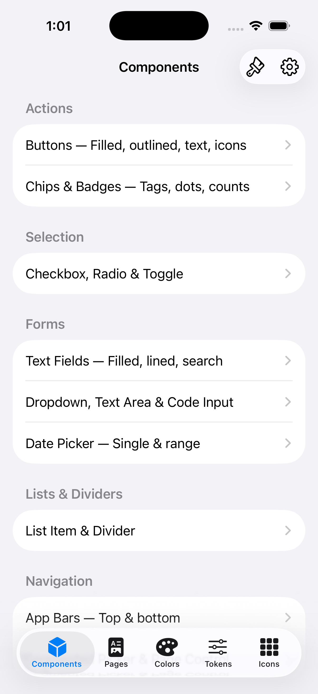
  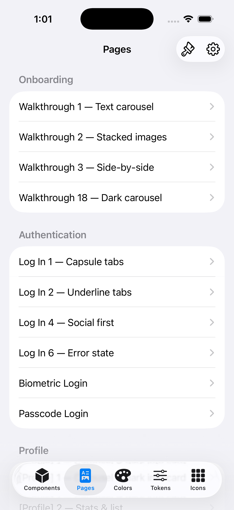
  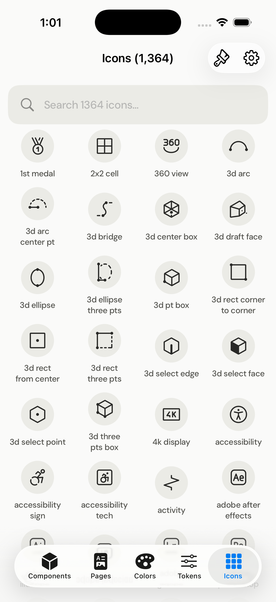
</p>

### Color Palettes by Brand

<p align="center">
  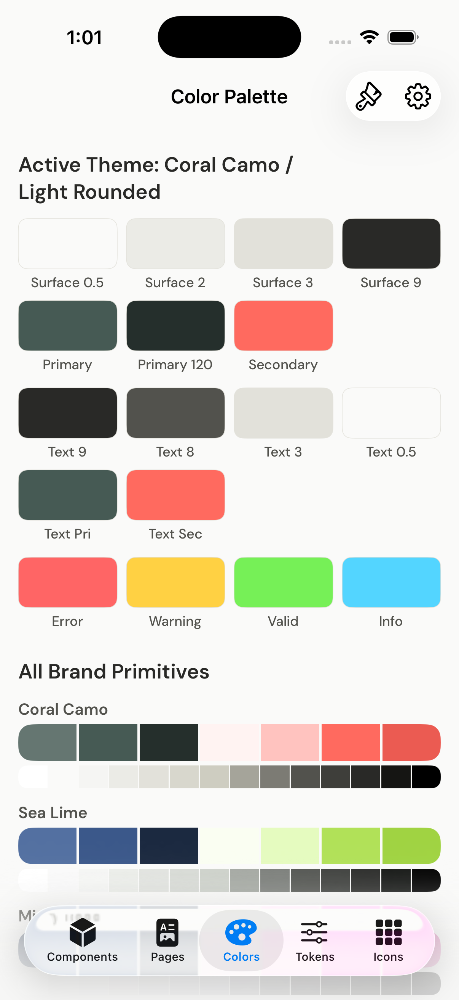
  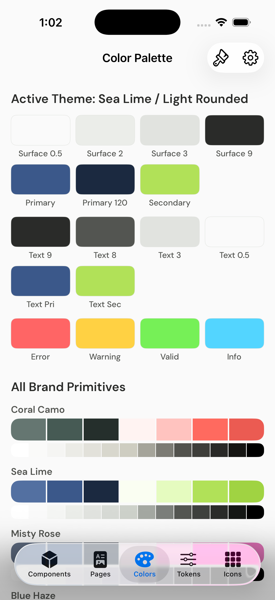
  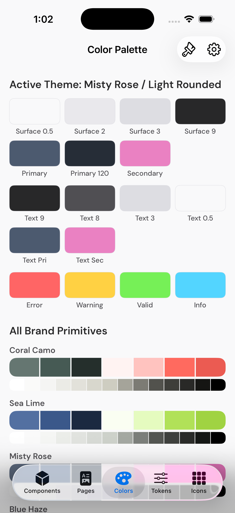
  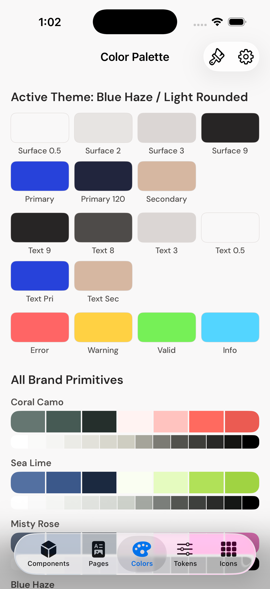
</p>

### Design Tokens

<p align="center">
  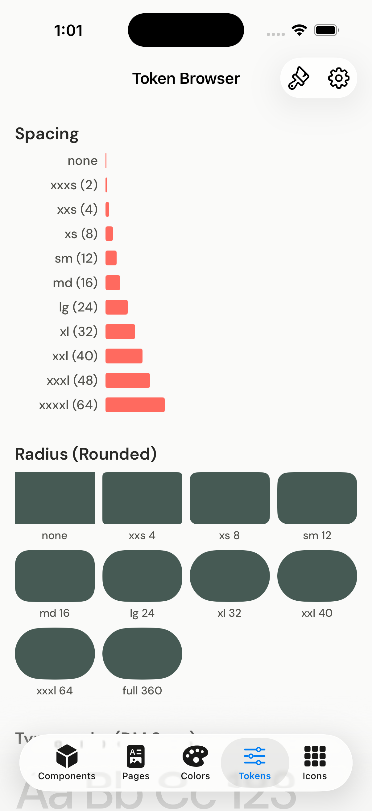
</p>

### Dark Mode

<p align="center">
  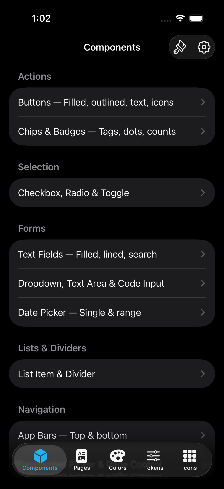
  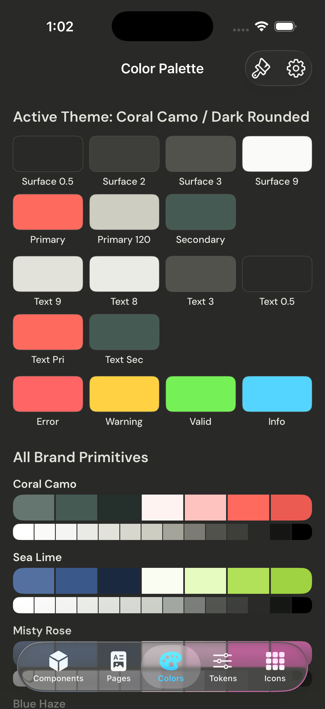
  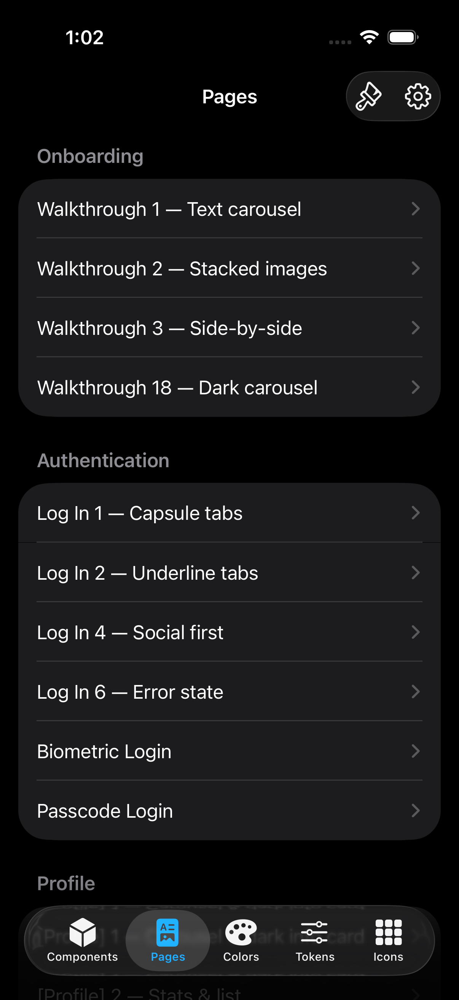
</p>

*Run the VitrineApp scheme in Xcode to preview all 16 theme combinations across 4 brands and 4 styles.*

## Requirements

- iOS 16+
- Swift 5.9+
- Xcode 15+

## Built By

[Omar Doucoure](https://omardoucoure.com)

## License

See [LICENSE](LICENSE) for details.
